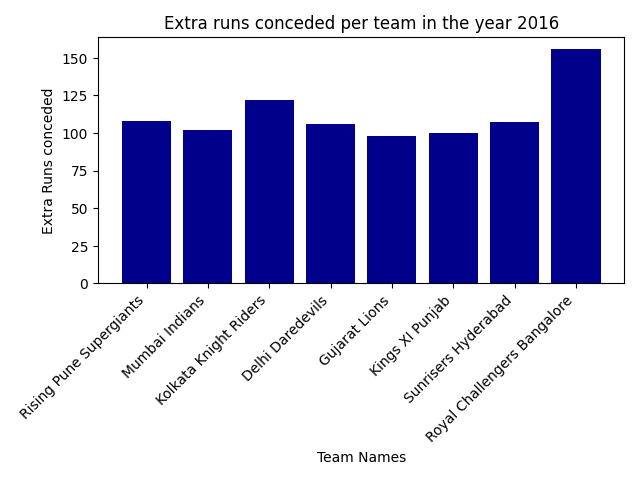

### How to Run the Project

#### 1. Clone the repository


```bash
git clone git@github.com:DwipenduKundu/Ipl_Project_data_analysis.git
cd company-master-data_analysis
```

#### 2. Set up a virtual environment (recommended)

```bash
python -m venv venv
#linux
source venv/bin/activate     
# On Windows: venv\Scripts\activate
```

#### 3. Install dependencies

```bash
pip install -r requirements.txt
```


#### 4. Run the script

##### go through the answers now

---


# Tasks

## IPL Analysis

### IPL data set analytics

#### Aim

To convert raw open data (run by run records in this case) into charts that tell some kind of story.

#### raw data

The data for this exercise is sourced from https://www.kaggle.com/manasgarg/ipl/version/5.

*NOTE* you might have to find data sources on your own. For example the country of origin for the Umpires.

#### Instructions

1. Download all the data needed. Consult your mentor if you have any problems accessing the raw data.
1. Initialize python project with a separate virtualenv. All your code should be in Python.
1. Enable pylint for this project.
1. This project should have separate repo on Gitlab.com.
1. All projects should have README.md with instructions on how to run this project.

#### What your program should do

From the CSV and other source files specified above, write python code to ...
1. Read in the data.
2. Write logic to slice / dice / accumulate / transform the data.
3. Using matplotlib plot the plots specified in the following section.


#### Problems

##### 1. Total runs scored by team
Plot a chart of the total runs scored by each teams over the history of IPL.
Hint: use the total_runs field.

##### 2. Top batsman for Royal Challengers Bangalore

Consider only games played by Royal Challengers Bangalore. Now plot the total runs scored by top 10 batsman playing for Royal Challengers Bangalore over the history of IPL.

Plot only top 10 batsmen by runs scored in RCB.

##### 3. Foreign umpire analysis

Obtain a source for country of origin of umpires.
Plot a chart of number of umpires by in IPL by country. Indian umpires should be ignored as this would dominate the graph.

##### 4. Stacked chart of matches played by team by season

Plot a stacked bar chart of ...

- number of games played
- by team
- by season


##### 5. Number of matches played per year for all the years in IPL.
Plot a bar chart.

##### 6. Number of matches won per team per year in IPL.
Plot a stacked bar chart.

##### 7. Extra runs conceded per team in the year 2016
Plot a bar chart.

##### 8. Top 10 economical bowlers in the year 2015
Plot a bar chart.

# Answers:
### 1. Total runs scored by team
Plot a chart of the total runs scored by each teams over the history of IPL. Hint: use the total_runs field.

Open ipl.py and run the script execute() function will take care of everything.


----------------------
### 2. Top batsman for Royal Challengers Bangalore
Consider only games played by Royal Challengers Bangalore. Now plot the total runs scored by top 10 batsman playing for Royal Challengers Bangalore over the history of IPL.

Open ipl2.py and run the script execute2() function will take care of everything.


--------------------

### 3. Foreign umpire analysis
Obtain a source for country of origin of umpires. Plot a chart of number of umpires by in IPL by country. Indian umpires should be ignored as this would dominate the graph.

Open ipl3.py and run the script execute3() function will take care of everything.


--------------------

### 4. Stacked chart of matches played by team by season
Plot a stacked bar chart of


number of games played


by team


by season


Open ipl4.py and run the script execute4() function will take care of everything.


----------------

### 5. Number of matches played per year for all the years in IPL.
Plot a bar chart.

Open ipl5.py and run the script execute5() function will take care of everything.


-------------------

### 6. Number of matches won per team per year in IPL.
Plot a stacked bar chart.

Open ipl6.py and run the script execute6() function will take care of everything.


-------------------

### 7. Extra runs conceded per team in the year 2016
Plot a bar chart.

Open ipl7.py and run the script execute7() function will take care of everything.



---------------------

#### 8. Top 10 economical bowlers in the year 2015
Plot a bar chart.

Open ipl8.py and run the script execute8() function will take care of everything.


