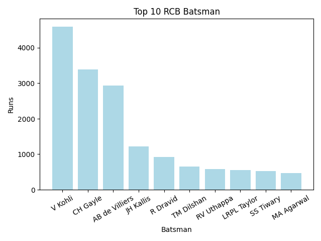
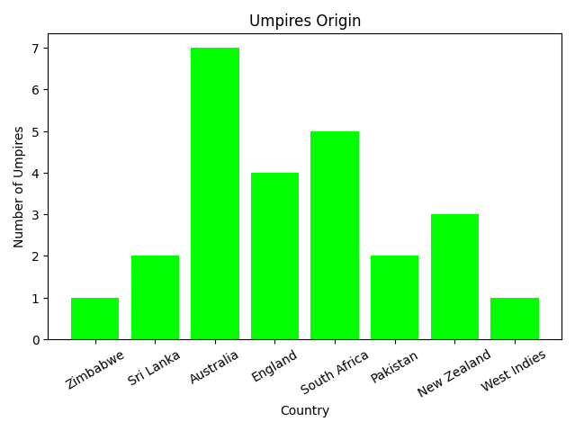
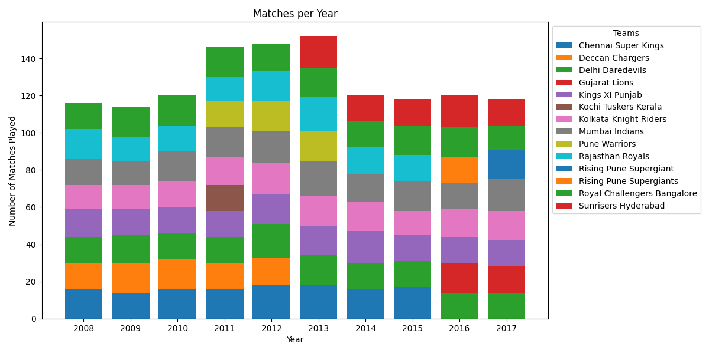
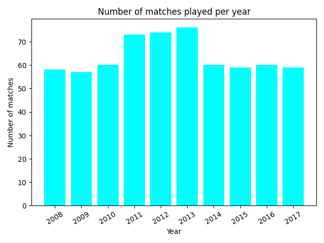
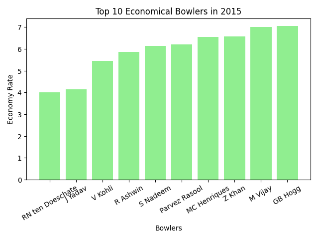

# IPL Analysis

### 1. Total runs scored by team
Plot a chart of the total runs scored by each teams over the history of IPL. Hint: use the total_runs field.

Open ipl.py and run the script Start() function will take care of everything.

----------------------
### 2. Top batsman for Royal Challengers Bangalore
Consider only games played by Royal Challengers Bangalore. Now plot the total runs scored by top 10 batsman playing for Royal Challengers Bangalore over the history of IPL.

Open ipl2.py and run the script start2() function will take care of everything.

--------------------

### 3. Foreign umpire analysis
Obtain a source for country of origin of umpires. Plot a chart of number of umpires by in IPL by country. Indian umpires should be ignored as this would dominate the graph.

Open ipl3.py and run the script start3() function will take care of everything.

--------------------

### 4. Stacked chart of matches played by team by season
Plot a stacked bar chart of

number of games played

by team

by season

Open ipl4.py and run the script start4() function will take care of everything.

----------------

### 5. Number of matches played per year for all the years in IPL.
Plot a bar chart.

Open ipl5.py and run the script start5() function will take care of everything.

-------------------

### 6. Number of matches won per team per year in IPL.
Plot a stacked bar chart.

Open ipl6.py and run the script start6() function will take care of everything.

-------------------

### 7. Extra runs conceded per team in the year 2016
Plot a bar chart.

Open ipl7.py and run the script start7() function will take care of everything.

---------------------

#### 8. Top 10 economical bowlers in the year 2015
Plot a bar chart.

Open ipl8.py and run the script start8() function will take care of everything.

